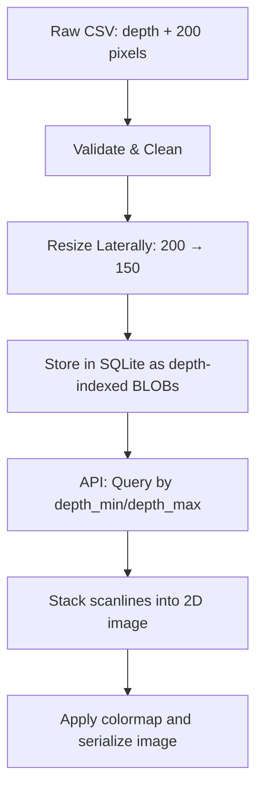

# 01. Problem Understanding

> **One Line Summary**

> This challenge appears to be about serving borehole "image log" data as depth-framed images. However, the provided CSV contains no explicit labels or segmentation masks — only a depth column and 200 pixel columns per row. Based on exploratory analysis, the problem is reframed as **depth-indexed image retrieval and visualization** with deterministic preprocessing (validation, resizing, storage, and colormapping). This document explains the data analysis, assumptions, and architectural trade-offs that informed that decision.

---

## 1. Requirements Analysis

### Core Requirements

**Functional**:
- Ingest the provided CSV into a queryable store
- Treat each depth sample as one grayscale scanline
- Allow querying by depth range (min/max)
- Return 2D images for requested depth intervals
- Apply domain-appropriate colormaps at read time

**Non-Functional**:
- Ingestion: complete in seconds on a single CPU (for csv similar to given one)
- Query latency: sub-second for typical depth ranges
- Deterministic, reproducible preprocessing
- Containerized, self-contained service (SQLite + API)

### Constraints Discovered

**Hard Constraints**:
- **Single well, single CSV**: no notion of multi-well identity in the data (but we should plan easy extension)
- **Fixed lateral resolution**: exactly 200 pixel columns per row

**Soft Constraints**:
- Pixel values observed in [13, 237], but stored as 0–255-capable uint8
- Depths strictly monotonic with 0.1 step (no gaps)
- Exactly one trailing row is entirely NaN (CSV artifact)

---

## 2. Dataset Exploration

### Dataset Statistics

| Metric | Value | Implication |
|--------|-------|-------------|
| Total rows | 5,461 raw, 5,460 valid | One all-NaN row dropped during ingestion |
| Columns | 1 depth + 200 pixels | Classic line-scan layout |
| Depth range | 9000.1 – 9546.0 | ~546 units of borehole coverage |
| Depth step | 0.1 (uniform, no gaps) | Clean indexing; no interpolation needed |
| Pixel range | 13 – 237 (observed) | Safe to store as uint8; headroom for outliers |
| Monotonic | Strictly increasing | Depth can be the PRIMARY KEY |

Full analysis with figures: see [notebooks/01_exploration.ipynb](notebooks/01_exploration.ipynb).

### Acquisition & Geometry Interpretation

Exploration suggests the data is **most consistent with borehole image log data** from a wireline imaging tool:

- Each row is a scanline at a specific depth
- 200 pixel columns represent azimuth around the borehole wall
- Successive rows form a continuous 2D image when stacked by depth
- Pixel intensities behave like normalized resistivity measurements

This is effectively a **line-scan camera** moving along depth.

### Data Quality Observations

- Depths are strictly increasing with uniform 0.1 spacing
- Aside from the final all-NaN row, no gross null patterns were observed
- Pixel histograms are well-behaved; no clipping at 0 or 255
- Visualizing stacked scanlines shows coherent geological textures

Implication: the dataset is clean enough to process deterministically without heavy statistical cleaning or interpolation.

---

## 3. Problem Reframing

**Problem Statement**:
> Given a single well log CSV with depth and 200-pixel scanlines, build a **deterministic pipeline** that ingests, validates, resizes, and stores the data, then serves **depth-range images on demand** with configurable colormaps.

---

## 4. Assumptions & Validation

### Assumption 1: Data represents a single continuous wellbore

**Validation**:
- Depths are strictly increasing with no gaps at the 0.1 step
- No resets or discontinuities observed in the depth column

**Conclusion**: Treat as a single continuous well; multi-well handling is out of scope.

### Assumption 2: Lateral axis is azimuth around the borehole

**Validation**:
- 200 columns per row is typical of imaging pads or azimuthal sectors
- Textures are continuous laterally when visualized as an image

**Conclusion**: Safe to interpret columns as angular position; justifies treating each row as a scanline.

### Assumption 3: Resizing 200 → 150 pixels preserves geological features

**Validation** (see [notebooks/02_resizing_analysis.ipynb](notebooks/02_resizing_analysis.ipynb)):
- Compared NEAREST, LINEAR, CUBIC, LANCZOS4, and AREA
- Evaluated spatial error, azimuthal FFT, gradient energy, and downsample→upsample error
- AREA behaved as a proper decimation filter (suppresses aliasing, preserves large-scale structure)

**Conclusion**: `cv2.INTER_AREA` is an acceptable default for downsampling; interpolation method is configurable for future tuning.

### Assumption 4: Grayscale storage + runtime colormapping is sufficient

**Validation**:
- Domain practice favors grayscale or brown–white style resistivity maps
- Applying Matplotlib colormaps at read time produced visually interpretable images

**Conclusion**: Storing raw grayscale and deferring colormap choice to the API is flexible and storage-efficient.

---

## 5. Trade-Offs Accepted

### Trade-Off 1: Fixed downsampled width (150 pixels)

**Decision**: Store resized scanlines at 150 pixels laterally.

**Why**:
- Reduces storage and bandwidth without losing large-scale structure
- Simplifies client assumptions (fixed width for all frames)
- Matches challenge constraints where ultra-high lateral resolution is not critical

**Cost**: Very thin features (1–2 pixels wide) may be slightly blurred; acceptable given scope.

### Trade-Off 2: SQLite instead of a time-series database

**Decision**: Use SQLite with per-depth BLOB rows.

**Why**:
- Total data volume is small (~800 KB for 5,460 × 150 uint8)
- No operational overhead; single-file DB is ideal for a challenge deliverable
- Repository abstraction allows swapping to Postgres/TimescaleDB if needed

**Cost**: Not horizontally scalable by itself, but good enough for this problem.

### Trade-Off 3: No ML-based enhancement or denoising

**Decision**: Keep the pipeline purely deterministic (NumPy, OpenCV).

**Why**:
- No labels available
- Deterministic behavior is easier to reason about and test

**Cost**: No learned de-noising or super-resolution; images reflect raw sensor character.

### Trade-Off 4: Depth as the only query key

**Decision**: Use depth as the PRIMARY KEY and primary query axis.

**Why**:
- Matches how geoscientists consume logs (depth windows)
- Depth is clean, monotonic, and uniformly sampled

**Cost**: No support for multi-well or time-based queries in this version.

---

## 6. Risk Assessment

| Risk | Likelihood | Impact | Mitigation |
|------|-----------|--------|------------|
| Misinterpretation of pixel values (not actually resistivity) | Medium | Medium | Keep documentation explicit that interpretation is inferred, not guaranteed |
| Future datasets with different width or step | Medium | Medium | Make width and interpolation method configurable via `DPS_*` env vars |
| Larger datasets (many wells, millions of rows) | Low | High | Abstract DB access behind a repository to allow migration to a scalable backend |
| Colormap misuse (e.g. rainbow) | Medium | Low | Provide domain-appropriate defaults; registry can constrain allowed maps |
| Numeric edge cases (NaNs, out-of-range pixels) | Low | Medium | Validation step clips values and fills NaNs deterministically |

---

## 7. Success Criteria

### Minimum Viable Pipeline (MVP)

- Ingestion completes successfully from the provided CSV into SQLite
- Queries for arbitrary depth_min/depth_max return correctly shaped images
- At least one default colormap (`resistivity`) produces interpretable logs
- Service runs in Docker with no manual setup beyond mounting the CSV

### Production-Ready (for a similar real system)

- Support multiple wells via a well identifier in the schema
- Configurable depth units and reference datum
- Clear observability: structured logging, health checks, basic metrics
- Ability to reingest from updated CSVs without manual DB surgery

### Engineering Quality

- Deterministic, well-tested ingestion and retrieval pipeline
- Unit + integration tests covering validation, resizing, storage, and API wiring
- Type-checked codebase (mypy) and linted/autoformatted (ruff)
- Documentation that clearly explains assumptions, limitations, and design trade-offs
